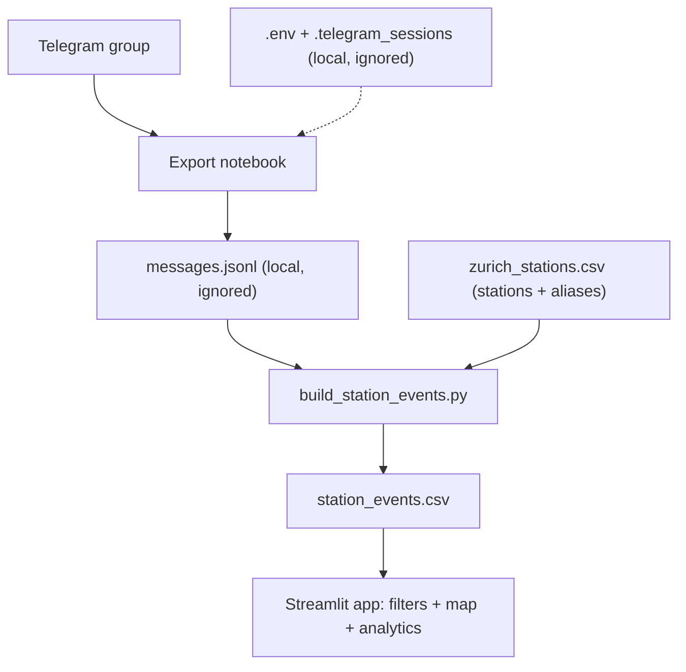

# Architecture and Data Flow

```mermaid
flowchart TD
    A["Telegram group"] --> B["Export notebook"]
    B --> C["messages.jsonl (local, ignored)"]
    C --> D["build_station_events.py"]
    E["zurich_stations.csv (stations + aliases)"] --> D
    D --> F["station_events.csv"]
    F --> G["Streamlit app: filters + map + analytics"]

    H[".env + .telegram_sessions (local, ignored)"] -.-> B
```
