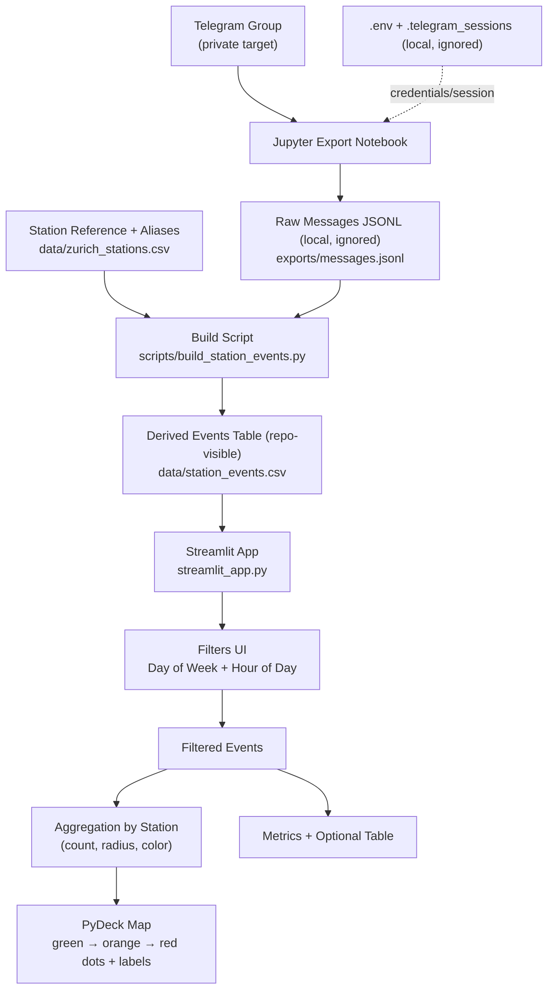

# Architecture and Data Flow

```mermaid
flowchart TD
    A["Telegram Group<br/>(private target)"] --> B["Jupyter Export Notebook"]
    B --> C["Raw Messages JSONL (local, ignored)<br/>exports/messages.jsonl"]

    D["Station Reference + Aliases<br/>data/zurich_stations.csv"] --> E["Build Script<br/>scripts/build_station_events.py"]
    C --> E

    E --> F["Derived Events Table (repo-visible)<br/>data/station_events.csv"]

    F --> G["Streamlit App<br/>streamlit_app.py"]
    G --> H["Filters UI<br/>Day of Week + Hour of Day"]
    H --> I["Filtered Events"]
    I --> J["Aggregation by Station<br/>(count, radius, color)"]
    J --> K["PyDeck Map<br/>green → orange → red dots + labels"]
    I --> L["Metrics + Optional Table"]

    M[".env + .telegram_sessions (local, ignored)"] -. "credentials/session" .-> B
```
